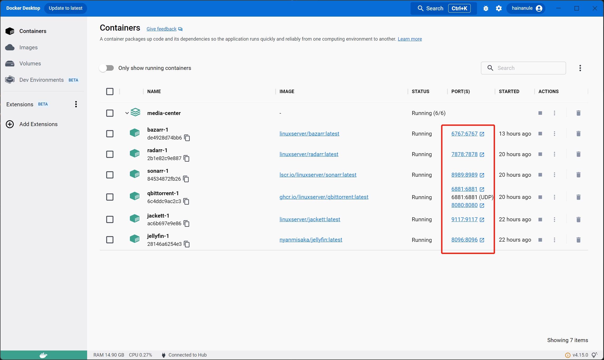
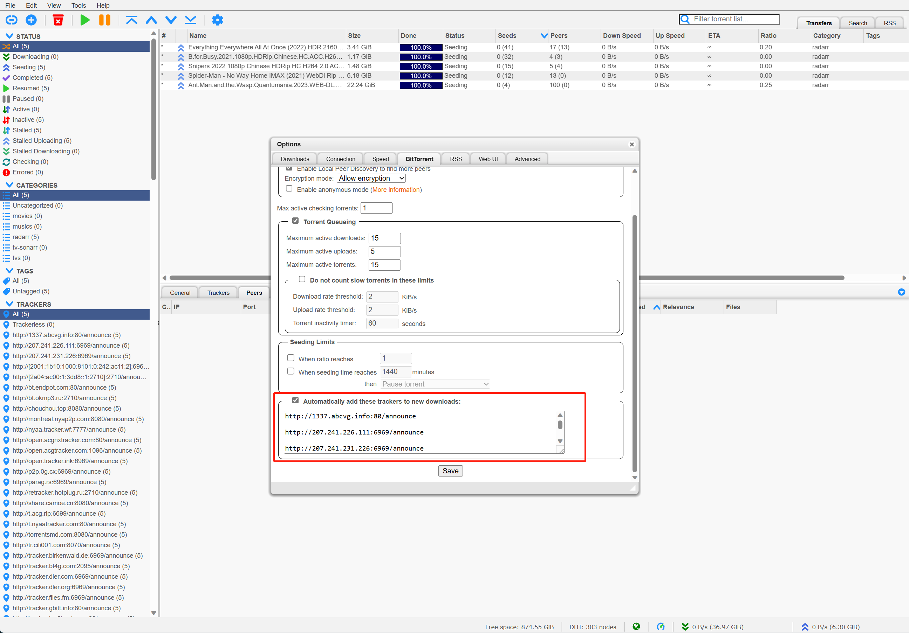

# Media center

## Introduction

Media-center in windows operating system, rely on WSL(also work well in really Linux) and nVidia Graph Card (there are a little different when the Graph Card intel or AMD, You need to modify the docker-compose.yml).

- jellyfin: media-player
- qbittorrent: download client
- radarr: for automaticly having movies
- sonarr: for automaticly having tv shows
- bazarr: is a companion application to Sonarr and Radarr. It can manage and download subtitles based on your requirements.
- jackett: is a companion application to Sonarr and Radarr. Scraps torrents sites looking for the things that you want

## How to use?

1. install docker and docker-compose

```
Download Docker Desktop for Windows.
Follow the usual installation instructions to install Docker Desktop. If you are running a supported system, Docker Desktop prompts you to enable WSL 2 during installation. Read the information displayed on the screen and enable WSL 2 to continue.
Start Docker Desktop from the Windows Start menu.
From the Docker menu, select Settings and then General.
Select the Use WSL 2 based engine check box.

If you have installed Docker Desktop on a system that supports WSL 2, this option is enabled by default.

Select Apply & Restart.
you can get more detail in docker for wsl [https://docs.docker.com/desktop/windows/wsl/#download]

中文版本:
WSL 2安装 docker和docker-compose
前提
在安装之前，必须确认如下步骤是否完成： Windows 10 版本 1903 以上或 Windows 11。 在 Windows 上启用 WSL 2 功能。 WSL 2 至少有一个 Linux 发行版，如 Ubuntu20.04 LTS。 下载并安装WSL Linux内核更新包

```

下载 docker desktop for windows [https://desktop.docker.com/win/main/amd64/Docker%20Desktop%20Installer.exe?utm_source=docker&utm_medium=webreferral&utm_campaign=dd-smartbutton&utm_location=header]

```
安装
安装前请务必确认满足上文的安装条件。

通常点击安装程序一直点击下一步即可。Docker Desktop 会在安装过程中提示启用 WSL 2。阅读屏幕上显示的信息并启用 WSL 2 以继续。
启动 Docker Desktop。
点击设置-> General。
勾选 Use the WSL 2 based engine (Windows Home can only run the WSL 2 backend)(一般情况下，默认是勾选的)。
点击Apply & Restart。

```


```
Docker Desktop启用 WSL 集成步骤
点击Resources -> WSL INTEGRATION
勾选 Enable integration with my default WSL distro，如果安装了多个WSL Linux发行版，也可以打开相应的发行版开关。
```

启用 WSL 中的 docker 和 docker-compose


```
现在docker和docker-compose都可以在 WSL 2 中使用了。
```

2. git clone this repository to your linux home directory (prefer WSL ubuntu distribution).

```
git clone https://github.com/EnnisL/media-center
```

3. check your nVidia driver.

```
nvidia-smi
```

4.copy `.env.sample` to `.env` (or just modify .env) and fill it with your data (username and password). And then run

```
sudo mkdir -p /mnt/samba/{configs,downloads}
sudo mkdir -p /mnt/samba/downloads/completed/movies
sudo mkdir -p /mnt/samba/downloads/completed/tv
sudo mkdir -p /mnt/samba/downloads/music
sudo mkdir -p /mnt/usb/

sudo docker-compose up -d`
```

5. setting up all software.
   you can click the port to set up all software.
   

## jackett

set up indexers website(for choose where torrent come from)


## radarr (for movie)

set up indexers(for choose where torrent come from)


## sonarr (for TV, the setting up is same as radarr)

## qBittorrent (download client)

set up tracker (if you do not set it, you can not download)

the tracker list [https://cf.trackerslist.com/all.txt] (open the website, copy and paste)


## bazarr (for movie and tv subtitles)

set up the subtitles providers.


## jellyfin (watching movie)

setting up accelerate with nVidia Graph Card.


watching movie

